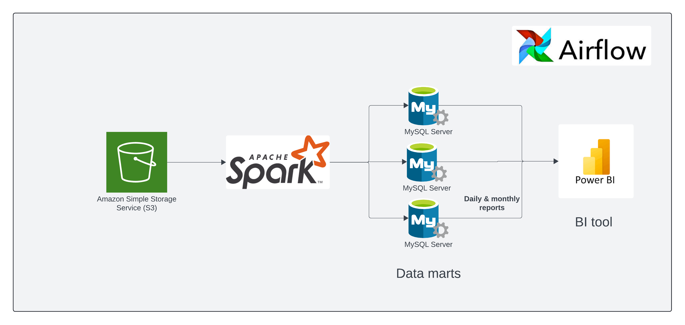
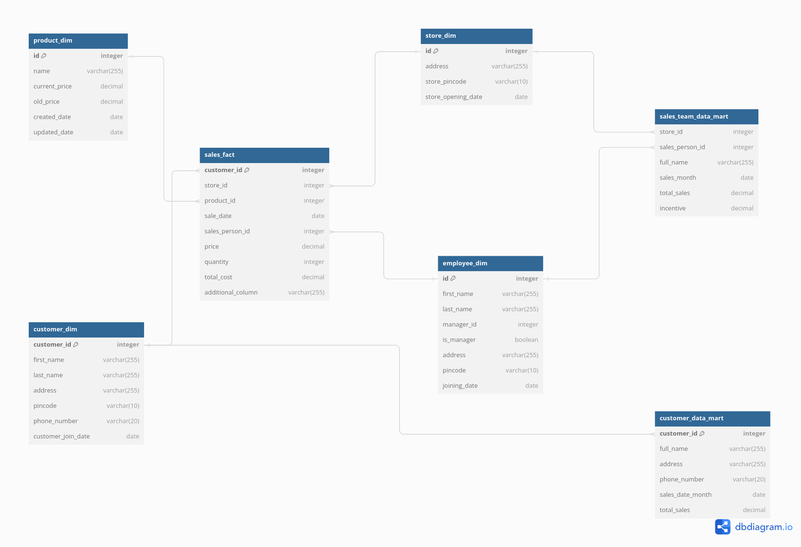

# Sales Incentive Program (SIP)
## Purpose

1. The billing department intends to incentivize based on total sales figures.
2. Tracking customer spending to offer coupons or discounts accordingly.
3. Daily and monthly reports are required for business monitoring.
4. Monthly reports are crucial for end-of-month analysis.

# Project Tasks

1. **Reading Data from S3**: Data generated by the transactional system is fetched from S3.
2. **Data Validation**: Ensuring the integrity and accuracy of the fetched data.
3. **Data Transformation**: Transforming the data as per business requirements.
4. **Writing to Data Mart**: Storing the processed data into a data mart for reporting.

## How it's Done

1. Utilizing S3 for data storage,
2. Spark is employed for data transformation tasks.
3. Processed data is pushed into the data mart for reporting needs.

## Understanding Data

## Data Warehouse Design

This outlines the design of a data warehouse for analyzing sales data. It includes fact tables and dimension tables, along with data marts for specific analysis needs.

### Fact Tables

**Fact Table: Sales**

| Column              | Description                                      |
|--------------------|--------------------------------------------------|
| customer_id         | Unique identifier for the customer                |
| store_id             | Unique identifier for the store where the sale occurred |
| product_id           | Unique identifier for the product sold             |
| sale_date            | Date of the sale                                    |
| sales_person_id     | Unique identifier for the salesperson who made the sale |
| price                | Unit price of the product sold                       |
| quantity             | Number of units of the product sold                  |
| total_cost           | Total cost of the sale (price x quantity)            |

**Description:**

- The Sales fact table stores detailed transactional data about each sale.
- It is the central table in the data warehouse and is linked to dimension tables for further analysis.

### Dimension Tables

**Customer Dimension Table**

| Column              | Description                                      |
|--------------------|--------------------------------------------------|
| customer_id         | Unique identifier for the customer                |
| first_name          | Customer's first name                                |
| last_name           | Customer's last name                                 |
| address             | Customer's address                                  |
| pincode             | Customer's postal code                               |
| phone_number        | Customer's phone number                              |
| customer_join_date  | Date the customer purchased first item                |

**Description:**

- Provides additional information about the customers who make purchases.

**Store Dimension Table**

| Column              | Description                                      |
|--------------------|--------------------------------------------------|
| store_id             | Unique identifier for the store location           |
| address             | Store address                                      |
| store_pincode        | Store's postal code                                  |
| store_opening_date  | Date the store opened                              |

**Description:**

- Contains details about the stores where sales take place.

**Product Dimension Table**

| Column              | Description                                      |
|--------------------|--------------------------------------------------|
| product_id           | Unique identifier for the product                 |
| name                | Name of the product                                   |
| current_price       | Current price of the product                       |
| old_price           |  Previous price of the product  |
| created_date        | Date the product information was added              |
| updated_date        |  Date the product information was last updated |

**Description:**

- Provides details about the products sold.

**Employee Dimension Table**

| Column              | Description                                      |
|--------------------|--------------------------------------------------|
| employee_id         | Unique identifier for the employee                 |
| first_name          | Employee's first name                                |
| last_name           | Employee's last name                                 |
| manager_id          | Unique identifier for the employee's manager |
| is_manager          | Flag indicating whether the employee is a manager (boolean) |
| address             | Employee's address                                  |
| pincode             | Employee's postal code                               |
| joining_date        | Date the employee joined the company                |

**Description:**

- Contains information about the employees who make sales.

### Data Marts

**Customer Data Mart**

| Column              | Description                                      |
|--------------------|--------------------------------------------------|
| customer_id         | Unique identifier for the customer                |
| full_name           | Customer's full name (concatenated first and last name) |
| address             | Customer's address                                  |
| phone_number        | Customer's phone number                              |
| sales_date_month    | Month in which the customer made a sale (extracted from sale_date) |
| total_sales         | Total sales amount for the customer across all sales |

**Description:**

- Pre-calculated data specifically focused on customer analysis.
- Includes derived attributes like `full_name` and `sales_date_month` for easier querying.

**Sales Team Data Mart**

| Column              | Description                                      |
|--------------------|--------------------------------------------------|
| store_id             | Unique identifier for the store location           |
| sales_person_id     | Unique identifier for the salesperson who made the sale |
| full_name           | (Optional) Full name of the salesperson (derived from Employee dimension table) |
| sales_month         | Month in which the sale occurred (extracted from sale_date) |
| total_sales         | Total sales amount for the salesperson across all sales within the store for the month |
| incentive           | (Optional) Calculated incentive based on sales performance (implementation details dependent on specific rules) |

**Description:**

- Pre-calculated data specifically tailored for sales team analysis.
- Includes derived attributes like `sales_month` and potentially `full_name` for efficient querying.
- The `incentive` column can be populated based on pre-defined rules within the data warehouse ETL process.

